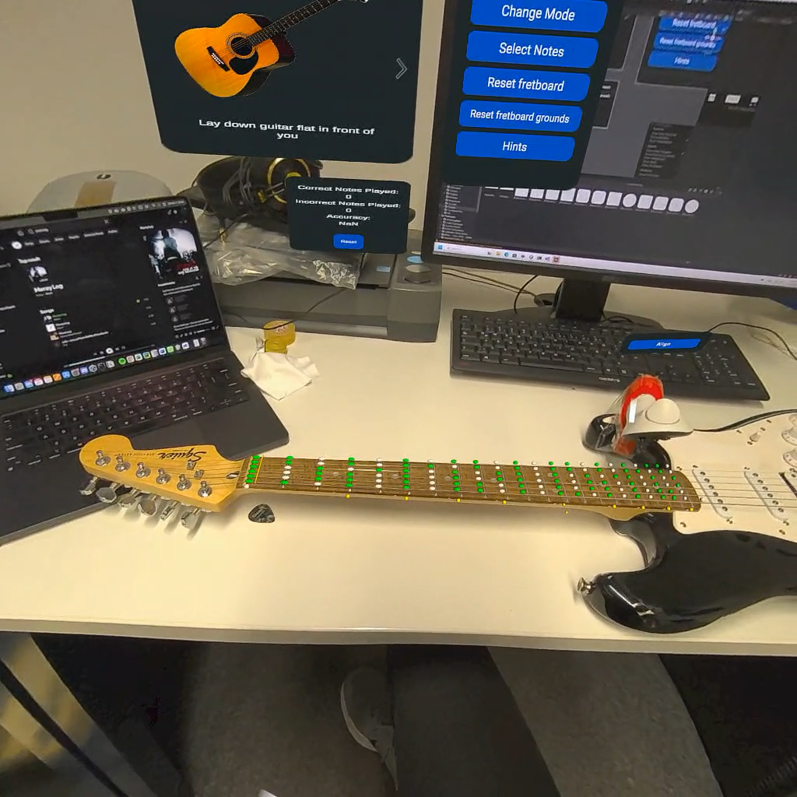
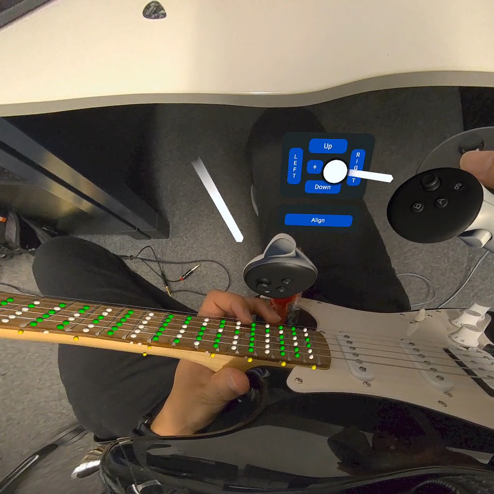

# GuitARVis - Augmented Reality Guitar Learning Tool

An Augmented Reality guitar learning and visualization tool built with Unity and Meta XR SDK for Meta Quest headsets.

## Overview

GuitARVis provides real-time visual feedback for guitar players by overlaying an augmented fretboard onto the physical guitar. The system reads live MIDI data from the guitar and visualizes the notes being played, helping users learn scales, improvise, and explore the fretboard.

## Features

- **Live MIDI Input**: Reads real-time MIDI data from the guitar to detect notes being played
- **Augmented Fretboard**: Virtual fretboard overlay that tracks and aligns with the physical guitar fretboard
- **Flexible Positioning**: Users can grab and move the augmented fretboard away from the guitar or lock it to the physical fretboard
- **Real-time Note Visualization**: Notes being played are displayed on the augmented fretboard, providing immediate visual feedback
- **Scale Mode**: Select a scale and see all notes within that scale highlighted in green, enabling in-scale improvisation
- **Heatmap Generation**: Visual heatmap showing which areas of the fretboard are used most frequently, encouraging exploration of new positions
- **Performance Statistics**: Tracks and displays metrics such as correct notes played

## Demo

## Requirements

- Unity
- Meta XR SDK
- Meta Quest headset
- MIDI-enabled guitar or MIDI pickup

## Getting Started

1. Clone the repository
2. Open the project in Unity
3. Ensure Meta XR SDK is properly configured
4. Connect your MIDI guitar
5. Build and deploy to your Meta Quest headset

## Usage

1. Put on your Meta Quest headset
2. Position the augmented fretboard over your guitar's physical fretboard
3. Lock the fretboard in place or keep it movable
4. Select your desired scale from the menu
5. Start playing and receive real-time visual feedback
6. Review the heatmap and statistics to track your progress

## License

This project is developed as part of a HiWi (student research assistant) project.
